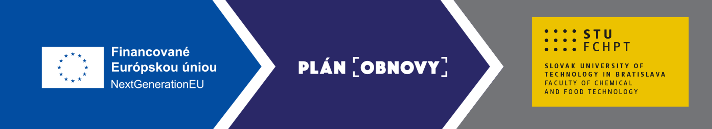

# Advanced Control Solutions Towards Resource Efficient Production (ACTREP)

> **Project No.:** 09I03-03-V04-00636  
> **Duration:** September 2024 – August 2026  
> **Principal Investigator:** Ing. Michaela Horváthová, PhD  
> **Host Institution:** Institute of Information Engineering, Automation, and Mathematics (UIAM), Faculty of Chemical and Food Technology, Slovak University of Technology in Bratislava

---

## Funding

This project is funded by the **European Union – NextGenerationEU** through the **Recovery and Resilience Plan for Slovakia** under Project No. **09I03-03-V04-00636**.



---

# About the Project

Advanced Control Solutions Towards Resource Efficient Production (ACTREP) focuses on the development of novel control methodologies that improve the energy efficiency of industrial processes while maintaining stability, robustness and computational efficiency.

The project develops advanced model predictive control methods suitable for embedded hardware with limited computational resources and validates the proposed approaches theoretically, numerically and experimentally.

The project is carried out at the **Institute of Information Engineering, Automation, and Mathematics (UIAM)**, Slovak University of Technology in Bratislava.

More information about the institute:

https://www.uiam.sk/?menu=3&show_id=5&r_p_id=180

---

# Research Objectives

The main objectives of ACTREP are:

- development of novel energy-efficient control methods,
- theoretical certification of stability and recursive feasibility,
- implementation on computationally constrained embedded platforms,
- experimental validation,
- dissemination of results through open science principles.

---

# Work Packages

## WP1 – Development of Novel and Improvement of Existing Energy-Efficient Control Methods

**Status:** Completed

Main activities:

- comprehensive literature review,
- development of novel approximate MPC algorithms,
- simulation studies,
- establishment of international collaboration.

---

## WP2 – Certification of the Control Methods

**Status:** Completed

Main activities:

- Lyapunov-based stability analysis,
- recursive feasibility certification,
- publication of theoretical results,
- public dissemination activities.

---

## WP3 – Increased Implementability of the Developed Approaches

**Status:** Completed

Main activities:

- algorithm simplification,
- implementation on embedded platforms,
- computational optimization,
- solver-free variance-adaptive approximated MPC implementation,
- implementation of time-varying tube MPC in the open-source MPTplus toolbox.

---

## WP4 – Experimental Implementations and Tool Development

**Status:** Ongoing

Main activities:

- experimental validation on the Flexy2 and laboratory heat-exchanger platforms,
- release of the ACTREP variance-adaptive approximated MPC software,
- contribution to the open-source MPTplus toolbox,
- public user documentation and reproducible tutorials,
- final project dissemination.

---

## Project Deliverables

| Deliverable | Description | Status | Resources |
|-------------|-------------|--------|-----------|
| D1.1 | Comprehensive Literature Review Report | ✅ Completed | 📄 [Report (PDF)](literarny_prehlad_sprava.pdf) |
| D1.2 | Experimental Recursive RS-based MPC | ✅ Completed | 📄 [Paper](RS_flexy.pdf) · 🗄️ [Zenodo](https://zenodo.org/records/15864834) |
| D1.3 | International research cooperation | ✅ Completed | 📄 [Conference paper](Submision_to_CDC2025.pdf) |
| D2.1 | Journal publication on control certification | ✅ Published | 📄 [Preprint](Submision_to_Neurocomputing.pdf) · 🔗 [DOI](https://doi.org/10.1016/j.neucom.2026.132637) · 🗄️ [Zenodo](https://zenodo.org/records/22142670) |
| D2.2 | Public lecture | ✅ Completed | 📄 [Presentation](popularizacna_prednaska.pdf) |
| D2.3 | Interim implementation report | ✅ Completed | *(available upon request)* |
| D3.1 | Optimized algorithm implementations for resource-constrained hardware | ✅ Completed | 🔗 [Variance-Adaptive MPC software](https://github.com/Michaela32/Variance_Adaptive_MPC_ACTREP) |
| D3.2 | Conference publication created with international research partners | ✅ Published and presented | 🔗 [ECC 2026 paper](https://ieeexplore.ieee.org/document/11625222) · 🗄️ [Zenodo](https://zenodo.org/records/22144038) · 📊 [Presentation](ECC2026_Variance_Adaptive_MPC_presentation.pdf) |
| D4.1 | Journal publication on algorithm design and practical implementation | ✅ Published | 🔗 [Control Engineering Practice article](https://www.sciencedirect.com/science/article/pii/S0967066125004253) · 🔗 [DOI](https://doi.org/10.1016/j.conengprac.2025.106663) |
| D4.2 | Conference publication on algorithm design and simulation results | ✅ Published and presented | 🔗 [ECC 2026 paper](https://ieeexplore.ieee.org/document/11625647) · 📄 [arXiv](https://arxiv.org/abs/2511.04437) · 📊 [Presentation](ECC2026_Deep_Koopman_EMPC_presentation.pdf) |
| D4.3 | Open-source tool package with user documentation and tutorials | ✅ Completed | 🔗 [ACTREP Variance-Adaptive MPC](https://github.com/Michaela32/Variance_Adaptive_MPC_ACTREP) · 🔗 [MPTplus](https://github.com/holaza/mptplus) · 📘 [MPTplus tutorial](https://github.com/holaza/mptplus/wiki/Time%E2%80%90Varying-Tube-MPC-design) |
| D4.4 | Grant application submitted to a grant agency and notification of Faculty management | ✅ Completed | **APVV (OptiAIM)**, submitted 6 February 2026; FCHPT STU is the applicant organization and Michaela Horváthová is a named project-team member |
| D4.5 | Final report on the achievements of the project | 🟡 In preparation | Formal submission will follow the grant agency's reporting deadline in September 2026; a public technical summary will be added after completion |

---

# Downloadable Project Files

The following public documents can be downloaded directly from this repository:

- 📄 [Comprehensive literature review report](literarny_prehlad_sprava.pdf) — D1.1
- 📄 [Experimental Application of Stochastic Approximated MPC](RS_flexy.pdf) — D1.2
- 📄 [International-cooperation conference manuscript](Submision_to_CDC2025.pdf) — D1.3
- 📄 [Supervised Learning for Robust Predictive Control: Safe and Tunable Approach](Submision_to_Neurocomputing.pdf) — D2.1
- 📄 [Presentation for the general public](popularizacna_prednaska.pdf) — D2.2
- 📊 [Variance-Adaptive Approximated MPC — ECC 2026 presentation](ECC2026_Variance_Adaptive_MPC_presentation.pdf) — D3.2
- 📊 [Deep Koopman Economic MPC — ECC 2026 presentation](ECC2026_Deep_Koopman_EMPC_presentation.pdf) — D4.2
- 📄 [ACTREP publicity poster](poster%20%282%29.pdf)
- 📄 **ACTREP final technical summary** — to be added as `ACTREP_final_technical_summary.pdf` after completion of the final reporting process

The interim implementation report, the APVV grant application, submission confirmations, and the official administrative final report are retained in the project records and are not published in this public repository.

---

# Project Milestones

| Milestone | Status |
|-----------|--------|
| MS1 Development of control methods | ✔ Achieved |
| MS2 Certification of control methods | ✔ Achieved |
| MS3 Public lecture | ✔ Achieved |
| MS4 Increased implementability | ✔ Achieved |
| MS5 Experimental implementation | ✔ Achieved |
| MS6 Open-source software release | ✔ Achieved |
| MS7 Grant proposal submission | ✔ Achieved — APVV-25-0314 submitted on 6 February 2026 |

---

# Publications

## Journal Articles

### Supervised Learning for Robust Predictive Control: Safe and Tunable Approach

**Neurocomputing**, 2026

https://doi.org/10.1016/j.neucom.2026.132637

Open-access record: https://zenodo.org/records/22142670

---

### Experimental Validation of Deep Koopman MPC for Real-Time Pasteurization Unit Control

P. Valábek, M. Horváthová, G. Pannocchia, and M. Klaučo

**Control Engineering Practice**, vol. 167, 2026, Article 106663

https://doi.org/10.1016/j.conengprac.2025.106663

https://www.sciencedirect.com/science/article/pii/S0967066125004253

---

## Conference Papers

### Experimental Application of Stochastic Approximated MPC

Process Control Conference (PC)

Open-access record: https://zenodo.org/records/15864834

---

### Variance-Adaptive Approximated MPC

**2026 European Control Conference (ECC)**, Reykjavík, Iceland, pp. 523–529

M. Horváthová, Y. Jiang, J. Holaza, S. Olaru, and J. Oravec

https://ieeexplore.ieee.org/document/11625222

Open-access record: https://zenodo.org/records/22144038

Presentation: [ECC2026_Variance_Adaptive_MPC_presentation.pdf](ECC2026_Variance_Adaptive_MPC_presentation.pdf)

---

### Deep Koopman Economic Model Predictive Control of a Pasteurisation Unit

P. Valábek, M. Horváthová, and M. Klaučo

**2026 European Control Conference (ECC)**, Reykjavík, Iceland, pp. 19–24

https://ieeexplore.ieee.org/document/11625647

Open-access preprint: https://arxiv.org/abs/2511.04437

Presentation: [ECC2026_Deep_Koopman_EMPC_presentation.pdf](ECC2026_Deep_Koopman_EMPC_presentation.pdf)

---

### Embedded Tube MPC with Time-Varying Cross-Section: Design and Real-Time Validation

Submitted to the **American Control Conference (ACC) 2027**.

The paper presents an implementation-focused reformulation of time-varying tube MPC, its integration into MPTplus, a numerical benchmark, and experimental validation on a laboratory heat-exchanger platform in a hardware-in-the-loop configuration.

---

# Open-Source Software and Toolbox Development

## ACTREP Variance-Adaptive Approximated MPC

The project released a compact, solver-free MATLAB implementation of the variance-adaptive approximated MPC method developed within ACTREP. The sampling covariance adapts according to changes in the applied control input, allowing the controller to broaden exploration after significant control changes and focus the search when the control input changes only slightly. A stabilizing support controller is included as a feasible fallback.

The public package contains:

- the variance-adaptive approximated MPC algorithm,
- a reproducible quadrotor case study,
- a stabilizing support-controller implementation,
- user documentation and a step-by-step tutorial,
- functional tests and an example result,
- machine-readable citation metadata,
- an MIT open-source licence,
- ACTREP and NextGenerationEU acknowledgement and publicity material.

The online implementation does not require MPT3, YALMIP, or an external optimization solver. The published example uses the quadrotor setup from the ECC 2026 paper with prediction horizon `N = 5`, `Nmax = 1000` samples, state constraints `−2 ≤ x ≤ 2`, input constraints `−5 ≤ u ≤ 5`, and variance-adaptation parameter `q = 0.6`.

Resources:

- 🔗 [Source code and documentation](https://github.com/Michaela32/Variance_Adaptive_MPC_ACTREP)
- 🔗 [ECC 2026 publication](https://ieeexplore.ieee.org/document/11625222)
- 📘 [Getting-started tutorial](https://github.com/Michaela32/Variance_Adaptive_MPC_ACTREP/blob/main/docs/getting_started.md)

## MPTplus Toolbox Contribution

During ACTREP, Michaela Horváthová implemented the time-varying cross-section tube MPC method in the established open-source **MPTplus** toolbox. This contribution concerns the software implementation, automated controller synthesis, documentation, numerical verification, and experimental validation of the method; it does not claim authorship of the original underlying theoretical formulation.

The implementation is available through the `TMPCController` class by selecting:

```matlab
options = {'TubeType','timevarying', ...
           'LQRstability',1, ...
           'solType',0};

TMPC = TMPCController(model,N,options);
```

The contribution includes:

- automated construction of time-varying tube MPC controllers,
- stage-dependent constraint tightening,
- a documented double-integrator benchmark,
- simulation and visualization commands,
- a public MPTplus wiki tutorial,
- experimental validation on a laboratory heat-exchanger platform under actuator and measurement disturbances,
- an implementation-focused paper submitted to ACC 2027.

MPTplus is distributed under the MIT licence and can be installed through `tbxManager`:

```matlab
tbxmanager install mptplus
```

Resources:

- 🔗 [MPTplus repository](https://github.com/holaza/mptplus)
- 📘 [Time-Varying Tube MPC tutorial](https://github.com/holaza/mptplus/wiki/Time%E2%80%90Varying-Tube-MPC-design)
- 📘 [Installation and maintenance](https://github.com/holaza/mptplus/wiki/Installation-and-maintenance)

Together, the dedicated ACTREP variance-adaptive MPC package and the MPTplus contribution provide the public software, user documentation, tutorials, reproducible examples, and experimental evidence associated with deliverable **D4.3** and milestone **MS6**.

---

# Follow-up Grant Application

The grant-application component of deliverable **D4.4** and milestone **MS7** is documented by the submitted application:

- **Call:** APVV
- **Project title:** *Integrated Optimization and Machine Learning for Reliable Modelling, Monitoring, and Control*
- **Acronym:** OptiAIM
- **Applicant organization:** Slovak University of Technology in Bratislava, Faculty of Chemical and Food Technology
- **Principal investigator:** doc. Ing. Radoslav Paulen, PhD.
- **Investigator:** Michaela Horváthová, named project-team member
- **Submission date:** 6 February 2026
- **Proposed duration:** 1 September 2026 – 31 August 2029

The application was submitted institutionally by FCHPT STU and identifies the Faculty's statutory representative. Faculty-level institutional involvement and awareness were therefore inherent in the formal submission process. Michaela Horváthová participated as a named member of the proposed research team; this statement does not claim that she was the principal investigator. Supporting application documentation is retained in the project records and is not published in this public repository.

---

# Open Science

The project follows Open Science principles.

Public resources include:

- project GitHub repository,
- publicly available publications,
- project documentation,
- [ACTREP Variance-Adaptive MPC software](https://github.com/Michaela32/Variance_Adaptive_MPC_ACTREP),
- [MPTplus open-source toolbox](https://github.com/holaza/mptplus),
- educational materials.

The official publisher or IEEE record is used as the authoritative publication reference. A Zenodo or arXiv link is additionally provided where an open-access repository copy is available. Repository DOIs identify the archived copies and are not presented as substitutes for publisher-assigned publication DOIs.

## GitHub Repository

https://github.com/Michaela32/ACTREP---Fellowship-for-Excellent-Researchers

## Open-Access Publication Records

- [Experimental Application of Stochastic Approximated MPC — Zenodo](https://zenodo.org/records/15864834)
- [Supervised Learning for Robust Predictive Control: Safe and Tunable Approach — Zenodo](https://zenodo.org/records/22142670)
- [Variance-Adaptive Approximated Model Predictive Control — Zenodo](https://zenodo.org/records/22144038)
- [Deep Koopman Economic Model Predictive Control of a Pasteurisation Unit — arXiv](https://arxiv.org/abs/2511.04437)

---

# International Collaboration

Current collaborations include:

- École Polytechnique Fédérale de Lausanne (EPFL)
- University of Pisa
- Université Paris Saclay
- Czech Technical University in Prague

---

# Project News

Selected milestones:

- September 2024 — Project launched
- 2025 — Process Control Conference publication
- 2025 — Public lecture for the general public
- 2025 — Control Engineering Practice publication
- 2026 — Neurocomputing publication
- 6 February 2026 — APVV-25-0314 (OptiAIM) grant application submitted
- 2026 — Two ECC conference publications
- 2026 — Public release of the ACTREP Variance-Adaptive MPC software
- 2026 — Time-varying tube MPC implementation and tutorial released in MPTplus
- 2026 — Embedded tube MPC paper submitted to ACC 2027
- September 2026 — Formal final-report submission according to the grant agency's reporting schedule

This section will be continuously updated during the project.

---

# Contact

**Ing. Michaela Horváthová, PhD**

Principal Investigator

Institute of Information Engineering, Automation, and Mathematics

Slovak University of Technology in Bratislava

https://www.uiam.sk/

ORCID

https://orcid.org/0000-0003-2295-8888

E-mail

michaela.horvathova@stuba.sk

---

© ACTREP – Advanced Control Solutions Towards Resource Efficient Production

Funded by the European Union – NextGenerationEU through the Recovery and Resilience Plan for Slovakia.
